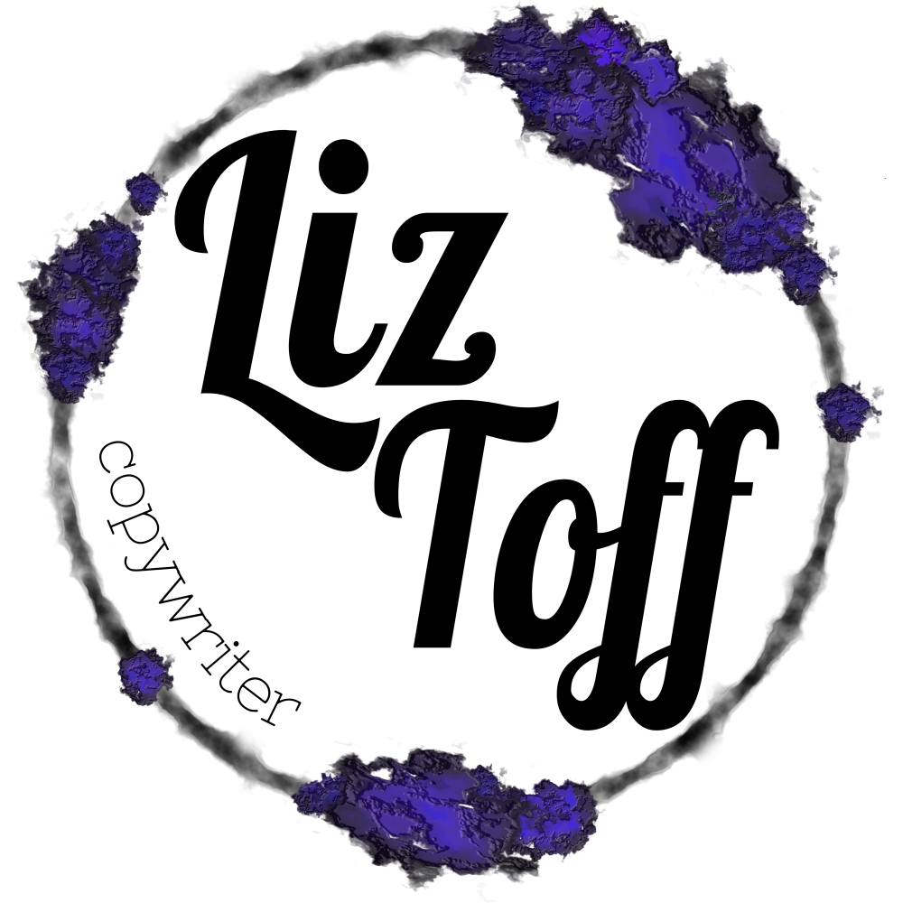

#  Source code for [liztoff.com](https://liztoff.com) 

## Get Started Developing

1. Install [`nvm`](https://github.com/nvm-sh/nvm). _Not a hard requirement, but helps eliminate potential issues._
1. `$ nvm install` - Initialize the local node environment with the version of Node validated against.
1. `$ npm install` - Install all node dependencies.
1. `$ npm run release` - Perform all build steps and validations. Don't worry, does not deploy the site despite its name.

Most development changes can be tested with `npm run start`, which starts the webpack devserver on your machine.

You should test changes to the deployment script, configuration, or lambda code by deploying to the `liztoff-com-test` stack.

### Notes

The contact form and everything else will still continue to make requests to the production endpoints. This is usually okay and a local devserver can interact with the test api endpoint (`api-test.liztoff.com`) just fine.

The `reCAPTCHA` verification should fail on the devserver and test domains since the hostname will not match `(www.)?liztoff.com`.

## Composition

This is a fairly traditional, static website. It's written mainly with EJS templates, Sass for styling and Typescript for anything dynamic. It does not use frameworks, but is built and bundled with webpack.

There is actually only one HTML file and uses document fragments to navigate between sections. When JS is enabled in the browser, `window.history.replaceState` is used to make URLs more seamless.

## Deployment

The wesbite is deployed via Github Actions with a standard S3/CloudFront CloudFormation template, using Route53 for DNS resolution. In addition to the static site, there is a contact form that submits to a Lambda behind API Gateway. This form should still work even without JS enabled. This does utilize the [quittle/s3-upload-custom-resource-lambda-layer](https://github.com/quittle/s3-upload-custom-resource-lambda-layer) project to upload the static assets.

## External Services

This website runs entirely on AWS. The contact form is guarded by Google's reCAPTCHA service and is onboarded with Google Analytics and Google Search Console to track access patterns.
